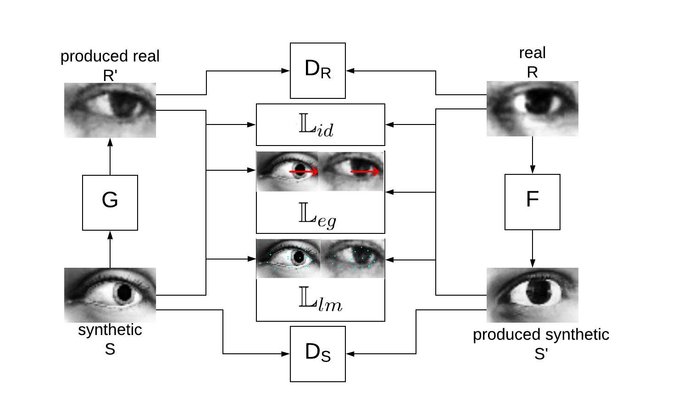

# FP-GAN TensorFlow
This repository contains a re-implementation of the model proposed by Lee et al. (2018) in their paper "Unpaired image-to-image translation using cycle-consistent adversarial networks".

As an extension, we added a feature preserving cost function. We preserve eye gaze directions, as well as regional landmarks when training the image translation networks.

A report explaining this method in detail will be uploaded soon.

Repository-URL: [https://github.com/mbbuehler/FP-GAN](https://github.com/mbbuehler/FP-GAN)

## Overall Architecture



There are four domains, two of them
represent the original images from MPIIGaze (R) and UnityEyes (S). The other two domains represent images produced by the generators G and F. We calculate the standard
GAN loss from the discriminators (DS and DR). For the eye gaze consistency (L_eg) and
landmark losses (L_lm), we trained two additional Convolutional Neural Networks. The
identity-transform loss (L_id) can directly be calculated. The cycle-consistency loss (L_cyc) is
being omitted in order to reduce cluttering. For an illustration, please refer to Fig. 3 of the
original CycleGAN paper [Zhu et al. 2017].

## Qualitative Results
Qualitative comparison of the translations. The leftmost columns correspond to the original images.
Columns a) to d) correspond to the following settings: a) λ_id = 2, λ_eg = λ_lm = 0 b)
λ_eg = 30, λ_id = λ_lm = 0 c) λ_lm = 15, λ_id = λ_eg = 0 d) λ_id = 5, λ_eg = 15, λ_lm = 0
(failed). We observe that in column d), the weights of the feature losses were too high and
therefore, the generator did not produce images that were optically different to the input
images.

### Real to Synthetic

### Synthetic to Real


## Quick Start
For more detailed step by step instructions see below.

0. Install requirements
1. Download the [datasets](http://mbuehler.ch/public_downloads/fpgan/data.zip): MPIIFaceGaze and UnityEyes
2. Create a config file for the FP-GAN
3. Download the [pre-trained models](http://mbuehler.ch/public_downloads/fpgan/models.zip) for feature consistency
4. Train the FP-GAN model
5. Translate images
6. (optional) Create a config file for a gaze estimator. Then, train a gaze estimation network and run inference.


## Folder Structure

The `cfg` folder contains the config files (`.ini`) for the FP-GAN and the gaze estimator networks.

The folder `documentation` includes a detailed report and some illustrations.

The `src` folder contains the source code. These are the subfolders:

* ```input```: dataset classes and preprocessing scripts
* ```models```: eye gaze estimation models, GAN models (Generator, Discriminator, Feature Models) and scripts for model export / inference
* ```run```: scripts for running model training, inference, testing and visualisations
* ```util```: various helper scripts
* ```visualisations```: various visualisation scripts

## Setup
0. Install requirements
```pip install -r requirements.txt ```

1. Download and unzip the datasets

   Download and unzip the ready-to-use datasets for [MPIIFaceGaze](https://www.mpi-inf.mpg.de/departments/computer-vision-and-multimodal-computing/research/gaze-based-human-computer-interaction/its-written-all-over-your-face-full-face-appearance-based-gaze-estimation/) and [UnityEyes](https://www.cl.cam.ac.uk/research/rainbow/projects/unityeyes/) from [here](http://mbuehler.ch/public_downloads/fpgan/data.zip).

   As an alternative, you can pre-process the data yourself. Download it from the [MPIIFaceGaze website](https://www.mpi-inf.mpg.de/departments/computer-vision-and-multimodal-computing/research/gaze-based-human-computer-interaction/its-written-all-over-your-face-full-face-appearance-based-gaze-estimation/) and convert it to an h5 File with one group per person (e.g. 'p01'). For each per person add a sub group for "image" (the eye image), "gaze" (the gaze direction in 2D) and "head" (the head pose in 2D). You can find the pre-processing script that we used in our experiments on [Bitbucket](https://bitbucket.org/swook/preprocess4gaze).

   If you want to generate your own UnityEyes dataset, download [UnityEyes](https://www.cl.cam.ac.uk/research/rainbow/projects/unityeyes/) and follow their instructions. We recommend a size of at least 100,000 images.

2. Update [sample config file](config/fpgan_example.ini) for the FP-GAN to your needs.

   Make sure that the dataset (S, R) and feature model paths (ege_path, lm_path) are correct.

3. Download and unzip the [pre-trained models](http://mbuehler.ch/public_downloads/fpgan/models.zip) for feature consistency.

   Optionally, re-train the models for eye gaze and/or landmarks consistency.

4. Train an FP-GAN model

   Example command (run it from inside the `src` folder):
   ```
   python run/train_fpgan.py --config ../config/fpgan_example.ini --section DEFAULT
   ```

5. Translate images

   * Update the config file

      Before running the image translation, you need to update the config file with the newly trained model.

      We recommend copying the DEFAULT section and giving it a new name, e.g. `MYFPGAN`.
      Then, set the `checkpoint_folder` variable to the newly trained model.
      For example:
      ```checkpoint_folder=../checkpoints/20190113-1455```

   * Run the translations

      This will create subfolders in the FP-GAN checkpoint folder. Those subfolders will contain the refined images.
      Run this from inside the `src` folder.
      ```
      python run/run_fpgan_translations.py
          --config ../config/fpgan_example.ini
          --section MYFPGAN
          --direction both
      ```

6. (optional) Train your own gaze estimator or use the pre-trained one from above in order to estimate eye gaze performance.
   For this you need to set the `path_test` and `dataset_class_test` in the config file and run the test script. Again, we recommend to copy the `DEFAULT` section for this.

   ```
   path_test =  ../checkpoints/20190113-1455/refined_MPII2Unity
   dataset_class_test = refined
   ```
   Then, run the script (inside the `src` folder):
   ```python run/run_test_gazenet.py --config ../config/gazenet_example.ini --section MYGAZENET```

## Feedback
I am happy to get your constructive feedback. Please don't hesitate to contact me if you have comments or questions. Thank you.


## References

* LEE , K., KIM , H., AND SUH , C. 2018. Simulated+unsupervised learning with adaptive data
generation and bidirectional mappings. In International Conference on Learning Representations.
* WOOD , E., B ALTRUŠAITIS , T., MORENCY , L.-P., ROBINSON , P., AND BULLING , A. 2016.
Learning an appearance-based gaze estimator from one million synthesised images. In Pro-
ceedings of the Ninth Biennial ACM Symposium on Eye Tracking Research & Applications,
131–138.
[Website](https://www.cl.cam.ac.uk/research/rainbow/projects/unityeyes/)
* ZHANG , X., SUGANO , Y., FRITZ , M., AND BULLING , A. 2017. It’s written all over your face:
Full-face appearance-based gaze estimation. In Computer Vision and Pattern Recognition
Workshops (CVPRW), 2017 IEEE Conference on, IEEE, 2299–2308.
[Website](https://www.mpi-inf.mpg.de/departments/computer-vision-and-multimodal-computing/research/gaze-based-human-computer-interaction/its-written-all-over-your-face-full-face-appearance-based-gaze-estimation/)
* ZHU, J., PARK, T., ISOLA, P., AND EFROS, A. A. 2017. Unpaired image-to-image translation
using cycle-consistent adversarial networks. CoRR abs/1703.10593.
 [Website](https://junyanz.github.io/CycleGAN/)
